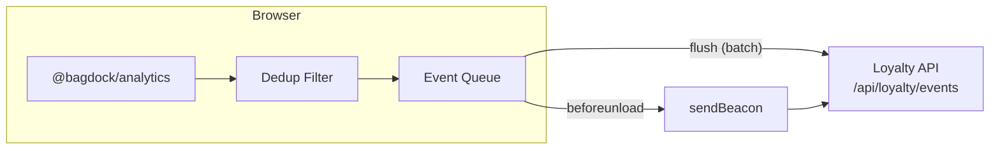
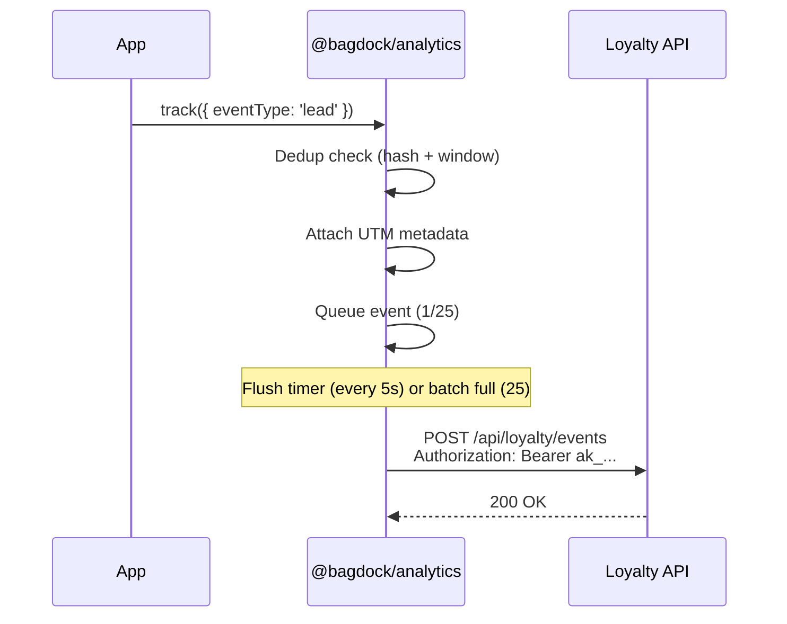
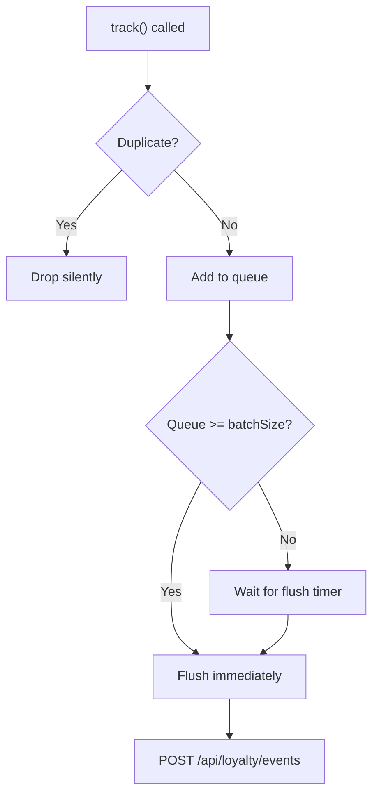

```
  ----++                                ----++                    ---+++     
  ---+++                                ---++                     ---++      
 ----+---     -----     ---------  --------++ ------     -----   ----++----- 
 ---------+ --------++----------++--------+++--------+ --------++---++---++++
 ---+++---++ ++++---++---+++---++---+++---++---+++---++---++---++------++++  
----++ ---++--------++---++----++---+++---++---++ ---+---++     -------++    
----+----+---+++---++---++----++---++----++---++---+++--++ --------+---++   
---------++--------+++--------+++--------++ -------+++ -------++---++----++  
 +++++++++   +++++++++- +++---++   ++++++++    ++++++    ++++++  ++++  ++++  
                     --------+++                                             
                       +++++++                                               
```

# @bagdock/analytics

Lightweight client-side event tracking for the Bagdock platform — automatic batching, deduplication, UTM attribution, and graceful teardown.

[](https://www.npmjs.com/package/@bagdock/analytics)
[](LICENSE)

## Install

```bash
npm install @bagdock/analytics
# or
bun add @bagdock/analytics
```

## How it works

The SDK queues events client-side, deduplicates within a configurable window, and flushes in batches to the Bagdock Loyalty API. On page unload it uses `sendBeacon` to avoid data loss.



### Event lifecycle



---

## Quick start

```typescript
import { BagdockAnalytics } from '@bagdock/analytics'

const analytics = new BagdockAnalytics({
  apiKey: 'ak_live_...',
  autoPageView: true,
  debug: process.env.NODE_ENV === 'development',
})

// Track a lead conversion
analytics.trackLead({
  operatorId: 'opreg_acme',
  referralCode: 'REF123',
  metadata: { source: 'pricing_page' },
})

// Track a sale
analytics.trackSale({
  operatorId: 'opreg_acme',
  valuePence: 14900,
  currency: 'GBP',
})

// Flush immediately (e.g., before navigation)
await analytics.flush()

// Teardown (flushes remaining events, clears timers)
analytics.destroy()
```

---

## Use cases

### 1. Next.js App Router (React provider)

Wrap your app in an `AnalyticsProvider` that initializes once and tracks route changes.

```tsx
'use client'

import { useEffect, useRef } from 'react'
import { usePathname, useSearchParams } from 'next/navigation'
import { BagdockAnalytics } from '@bagdock/analytics'

let globalAnalytics: BagdockAnalytics | null = null

export function getAnalytics(): BagdockAnalytics | null {
  return globalAnalytics
}

export function AnalyticsProvider({ children }: { children: React.ReactNode }) {
  const pathname = usePathname()
  const searchParams = useSearchParams()
  const analyticsRef = useRef<BagdockAnalytics | null>(null)
  const prevPathRef = useRef<string>('')

  useEffect(() => {
    const apiKey = process.env.NEXT_PUBLIC_ANALYTICS_API_KEY
    if (!apiKey) return

    if (!analyticsRef.current) {
      analyticsRef.current = new BagdockAnalytics({
        apiKey,
        autoPageView: true,
        debug: process.env.NODE_ENV === 'development',
      })
      globalAnalytics = analyticsRef.current
    }

    return () => {
      analyticsRef.current?.destroy()
      analyticsRef.current = null
      globalAnalytics = null
    }
  }, [])

  useEffect(() => {
    const fullPath = pathname + (searchParams?.toString() ? `?${searchParams.toString()}` : '')
    if (fullPath === prevPathRef.current) return
    prevPathRef.current = fullPath
    analyticsRef.current?.trackPageView()
  }, [pathname, searchParams])

  return <>{children}</>
}
```

### 2. UTM attribution tracking

The SDK automatically captures UTM parameters from the URL on initialization, persists them in `sessionStorage`, and attaches them to every subsequent event.

```typescript
// User lands on: https://example.com?utm_source=google&utm_medium=cpc&utm_campaign=spring

const analytics = new BagdockAnalytics({ apiKey: 'ak_live_...' })

// UTM params are captured automatically
console.log(analytics.getUTM())
// { utm_source: 'google', utm_medium: 'cpc', utm_campaign: 'spring' }

// Every tracked event now includes UTM metadata
analytics.trackLead({ operatorId: 'opreg_acme' })
// → POST payload includes metadata: { utm_source: 'google', utm_medium: 'cpc', ... }
```

You can also parse UTM params manually:

```typescript
import { parseUTM } from '@bagdock/analytics'

const utm = parseUTM('https://example.com?utm_source=partner&utm_campaign=launch')
// { utm_source: 'partner', utm_campaign: 'launch' }
```

### 3. Embed / widget tracking

Track render events and clicks from embedded widgets or iframes.

```typescript
const analytics = new BagdockAnalytics({ apiKey: 'ak_live_...' })

// Track when a widget renders on a partner site
analytics.trackEmbedRender('opreg_acme')

// Track link clicks with referral attribution
analytics.trackClick('link_abc123', 'REF456')
```

### 4. Loyalty program events

Track points earned, rewards redeemed, and referral completions.

```typescript
analytics.track({
  eventType: 'points_earned',
  memberId: 'mem_abc',
  operatorId: 'opreg_acme',
  valuePence: 500,
  metadata: { reason: 'monthly_rental' },
})

analytics.track({
  eventType: 'reward_redeemed',
  memberId: 'mem_abc',
  metadata: { rewardId: 'rwd_xyz', tier: 'gold' },
})

analytics.track({
  eventType: 'referral_completed',
  referralCode: 'REF123',
  memberId: 'mem_abc',
})
```

---

## API reference

### `BagdockAnalytics`

| Method | Description |
|--------|-------------|
| `track(event)` | Track a custom event with full control over the payload |
| `trackClick(linkId, referralCode?)` | Track a link click with optional referral attribution |
| `trackLead(params)` | Track a lead conversion |
| `trackSale(params)` | Track a completed sale |
| `trackPageView()` | Track a page view (auto-captures URL and referrer) |
| `trackEmbedRender(operatorId?)` | Track when an embedded widget renders |
| `getUTM()` | Returns the current UTM attribution context |
| `flush()` | Flush the event queue immediately (returns `Promise<void>`) |
| `destroy()` | Flush remaining events, clear timers, and tear down listeners |

### `TrackableEvent`

```typescript
interface TrackableEvent {
  eventType: EventType
  linkId?: string
  memberId?: string
  operatorId?: string
  referralCode?: string
  valuePence?: number
  currency?: string
  landingPage?: string
  referrer?: string
  metadata?: Record<string, unknown>
}
```

### `EventType`

```typescript
type EventType =
  | 'click' | 'lead' | 'sale' | 'signup' | 'embed_render'
  | 'share' | 'qr_scan' | 'deep_link_open' | 'page_view'
  | 'reward_redeemed' | 'points_earned' | 'referral_completed'
```

### Utility exports

| Export | Description |
|--------|-------------|
| `parseUTM(url?)` | Parse UTM parameters from a URL string (or `window.location.href`) |
| `UTMParams` | TypeScript interface for UTM parameter shape |
| `BagdockAnalyticsConfig` | Configuration interface |
| `TrackableEvent` | Event payload interface |
| `EventType` | Union type of all supported event types |

## Configuration

| Option | Type | Default | Description |
|--------|------|---------|-------------|
| `apiKey` | `string` | — | **Required.** Your Bagdock analytics API key |
| `baseUrl` | `string` | `https://loyalty-api.bagdock.com` | Loyalty API base URL |
| `flushIntervalMs` | `number` | `5000` | Flush interval in milliseconds |
| `batchSize` | `number` | `25` | Max events per batch before auto-flush |
| `dedupWindowMs` | `number` | `500` | Dedup window — identical events within this window are dropped |
| `autoPageView` | `boolean` | `false` | Automatically track a page view on init |
| `debug` | `boolean` | `false` | Log SDK activity to console |

## Batching and deduplication

Events are queued and flushed on a timer or when the batch size is reached. Duplicate events (same `eventType + linkId + referralCode + memberId`) within the dedup window are silently dropped.



On page unload (`beforeunload`) and visibility change (`visibilitychange → hidden`), the SDK flushes using `navigator.sendBeacon` to avoid losing events during navigation.

## Zero dependencies

This SDK has no external runtime dependencies. It uses the native `fetch` API and `navigator.sendBeacon` for reliability. Designed to be as lightweight as possible for client-side use.

## Security

- The SDK only sends data **outbound** to the Loyalty API — it never reads or stores PII
- API keys should be scoped to analytics write access only
- UTM data is stored in `sessionStorage` (per-tab, cleared on tab close)
- All API requests use `Authorization: Bearer` headers over HTTPS

## License

MIT
