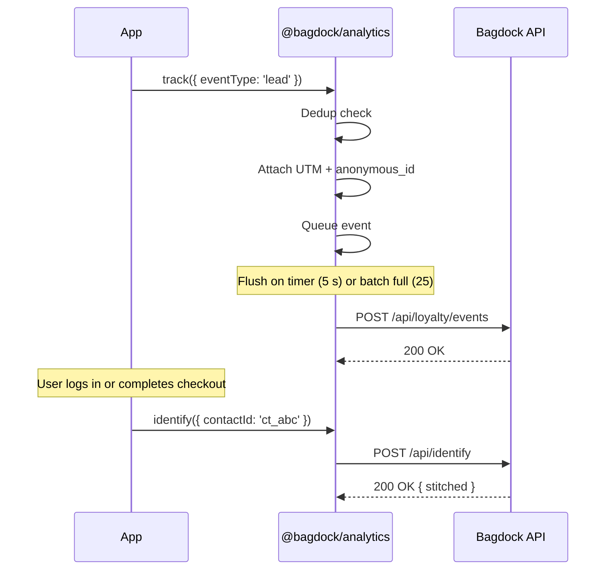
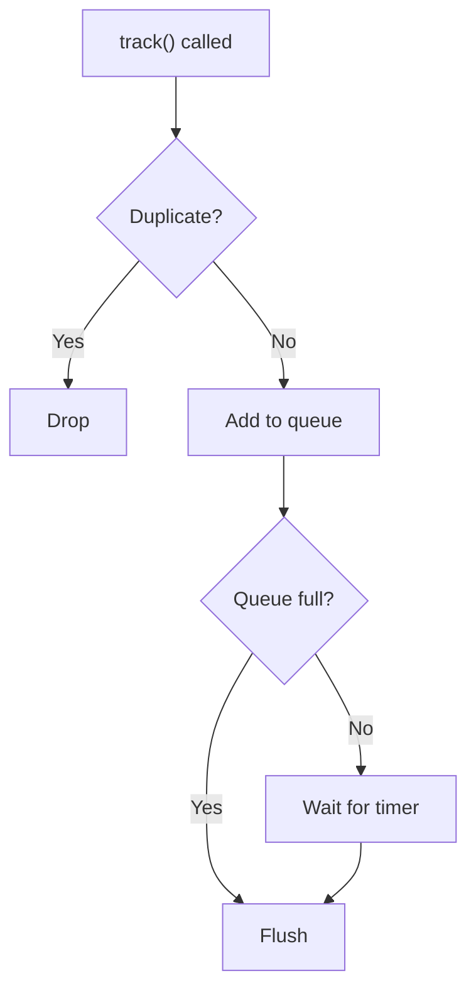

```
  ----++                                ----++                    ---+++     
  ---+++                                ---++                     ---++      
 ----+---     -----     ---------  --------++ ------     -----   ----++----- 
 ---------+ --------++----------++--------+++--------+ --------++---++---++++
 ---+++---++ ++++---++---+++---++---+++---++---+++---++---++---++------++++  
----++ ---++--------++---++----++---+++---++---++ ---+---++     -------++    
----+----+---+++---++---++----++---++----++---++---+++--++ --------+---++   
---------++--------+++--------+++--------++ -------+++ -------++---++----++  
 +++++++++   +++++++++- +++---++   ++++++++    ++++++    ++++++  ++++  ++++  
                     --------+++                                             
                       +++++++                                               
```

# @bagdock/analytics

Track events, identify visitors, attribute conversions, and measure engagement across Bagdock-powered self-storage apps. The SDK batches events client-side, deduplicates within a configurable window, captures UTM attribution automatically, stitches anonymous visitors to known contacts, and flushes gracefully on page unload.

[](https://www.npmjs.com/package/@bagdock/analytics)
[](https://bundlephobia.com/package/@bagdock/analytics)
[](LICENSE)

## Install

```bash
npm install @bagdock/analytics
# or
bun add @bagdock/analytics
```

## How tracking works

Your app calls `track()` methods. The SDK deduplicates, queues, and flushes events in batches to the Bagdock API over HTTPS.



On `beforeunload` and `visibilitychange`, the SDK flushes with `navigator.sendBeacon` so no events are lost during navigation.

---

## Get started

```typescript
import { BagdockAnalytics } from '@bagdock/analytics'

const analytics = new BagdockAnalytics({
  apiKey: 'YOUR_API_KEY',
  autoPageView: true,
})

analytics.trackLead({
  operatorId: 'opreg_acme',
  referralCode: 'REF123',
  metadata: { source: 'pricing_page' },
})

analytics.trackSale({
  operatorId: 'opreg_acme',
  valuePence: 14900,
  currency: 'GBP',
})

await analytics.flush()
analytics.destroy()
```

---

## How to track UTM attribution

The SDK captures UTM parameters from the URL on init, persists them in `sessionStorage` for the tab's lifetime, and attaches them as metadata to every event.

```typescript
// User lands on: https://example.com?utm_source=google&utm_medium=cpc&utm_campaign=spring

const analytics = new BagdockAnalytics({ apiKey: 'YOUR_API_KEY' })

analytics.getUTM()
// → { utm_source: 'google', utm_medium: 'cpc', utm_campaign: 'spring' }

analytics.trackLead({ operatorId: 'opreg_acme' })
// → event metadata includes utm_source, utm_medium, utm_campaign
```

Parse UTM parameters from any URL:

```typescript
import { parseUTM } from '@bagdock/analytics'

parseUTM('https://example.com?utm_source=partner&utm_campaign=launch')
// → { utm_source: 'partner', utm_campaign: 'launch' }
```

## How to use with Next.js App Router

Create a provider component that initializes the SDK once and tracks route changes:

```tsx
'use client'

import { useEffect, useRef } from 'react'
import { usePathname, useSearchParams } from 'next/navigation'
import { BagdockAnalytics } from '@bagdock/analytics'

export function AnalyticsProvider({ children }: { children: React.ReactNode }) {
  const pathname = usePathname()
  const searchParams = useSearchParams()
  const ref = useRef<BagdockAnalytics | null>(null)
  const prevPath = useRef('')

  useEffect(() => {
    if (!ref.current) {
      ref.current = new BagdockAnalytics({
        apiKey: process.env.NEXT_PUBLIC_ANALYTICS_API_KEY!,
        autoPageView: true,
      })
    }
    return () => { ref.current?.destroy(); ref.current = null }
  }, [])

  useEffect(() => {
    const path = pathname + (searchParams?.toString() ? `?${searchParams}` : '')
    if (path !== prevPath.current) {
      prevPath.current = path
      ref.current?.trackPageView()
    }
  }, [pathname, searchParams])

  return <>{children}</>
}
```

Wrap your root layout:

```tsx
<AnalyticsProvider>
  {children}
</AnalyticsProvider>
```

## How to track self-storage lifecycle events

Track key moments in the rental and deal lifecycle:

```typescript
// Rental reserved from checkout
analytics.track({
  eventType: 'rental.reserved',
  operatorId: 'opreg_acme',
  metadata: { unitId: 'unit_abc', facilitySlug: 'central-london' },
})

// Move-in completed
analytics.track({
  eventType: 'rental.moved_in',
  operatorId: 'opreg_acme',
  metadata: { rentalId: 'rent_xyz' },
})

// Deal won (converted to rental)
analytics.track({
  eventType: 'deal.won',
  operatorId: 'opreg_acme',
  valuePence: 14900,
  metadata: { dealId: 'deal_123', stage: 'closed_won' },
})

// Checkout completed
analytics.track({
  eventType: 'checkout.completed',
  operatorId: 'opreg_acme',
  valuePence: 9900,
  currency: 'GBP',
})
```

## How to track embed and widget events

Track renders and clicks from embedded widgets on partner sites:

```typescript
const analytics = new BagdockAnalytics({ apiKey: 'YOUR_API_KEY' })

analytics.trackEmbedRender('opreg_acme')
analytics.trackClick('link_abc123', 'REF456')
```

## How to track loyalty program events

Track points, rewards, and referrals:

```typescript
analytics.track({
  eventType: 'points_earned',
  memberId: 'mem_abc',
  operatorId: 'opreg_acme',
  valuePence: 500,
})

analytics.track({
  eventType: 'reward_redeemed',
  memberId: 'mem_abc',
  metadata: { rewardId: 'rwd_xyz', tier: 'gold' },
})

analytics.track({
  eventType: 'referral_completed',
  referralCode: 'REF123',
  memberId: 'mem_abc',
})
```

---

## How to identify visitors

When a visitor logs in, completes checkout, or submits a form, call `identify()` to stitch their anonymous browsing history to a known contact record. The SDK sends the anonymous ID to the Bagdock identify relay, which upserts a `contact_anonymous_ids` row in the operator database and backfills first-touch UTM attribution.

```typescript
const analytics = new BagdockAnalytics({ apiKey: 'YOUR_API_KEY' })

// After login / checkout / form submission
await analytics.identify({
  contactId: 'ct_abc123',
  operatorId: 'opreg_acme',
  traits: {
    email: 'jane@example.com',
    firstName: 'Jane',
  },
})
```

The anonymous ID is generated on first visit and persisted in both `localStorage` and a cross-subdomain cookie (`bagdock_anon_id`, `.bagdock.com`, 400-day TTL). This ensures the same anonymous ID follows a visitor across `bagdock.com` subdomains — marketing site, checkout, customer app — so pre-identify page views are attributed correctly after the visitor is identified.

```typescript
// Read the anonymous ID at any time
analytics.anonymousId
// → "a1b2c3d4-e5f6-7890-abcd-ef1234567890"
```

---

## Methods

| Method | Description |
|--------|-------------|
| `track(event)` | Track any event with full control over the payload |
| `trackClick(linkId, referralCode?)` | Track a link click with optional referral attribution |
| `trackLead(params)` | Track a lead conversion |
| `trackSale(params)` | Track a completed sale |
| `trackPageView()` | Track a page view (captures URL and referrer automatically) |
| `trackEmbedRender(operatorId?)` | Track when an embedded widget renders |
| `identify(params)` | Stitch the current anonymous ID to a known contact |
| `anonymousId` | Getter — the current anonymous ID (generated or restored) |
| `getUTM()` | Return the current UTM attribution context |
| `flush()` | Flush the event queue immediately |
| `destroy()` | Flush remaining events, clear timers, remove listeners |

## Types

### `TrackableEvent`

```typescript
interface TrackableEvent {
  eventType: EventType
  linkId?: string
  memberId?: string
  operatorId?: string
  referralCode?: string
  valuePence?: number
  currency?: string
  landingPage?: string
  referrer?: string
  metadata?: Record<string, unknown>
}
```

### `EventType`

```typescript
type EventType =
  // Engagement
  | 'click' | 'lead' | 'sale' | 'signup' | 'embed_render'
  | 'share' | 'qr_scan' | 'deep_link_open' | 'page_view'
  // Loyalty
  | 'reward_redeemed' | 'points_earned' | 'referral_completed'
  // Self-storage lifecycle
  | 'rental.reserved' | 'rental.paid' | 'rental.activated'
  | 'rental.moved_in' | 'rental.moved_out'
  | 'rental.renewed' | 'rental.cancelled' | 'rental.completed'
  // Deals / CRM
  | 'deal.created' | 'deal.stage_changed' | 'deal.won' | 'deal.lost'
  // Units
  | 'unit.occupied' | 'unit.vacated'
  // Checkout
  | 'checkout.started' | 'checkout.completed' | 'checkout.abandoned'
  // Marketing
  | 'marketing_event.attendance_recorded'
  // Contact
  | 'contact.identified' | 'contact.lifecycle_changed'
```

### `IdentifyParams`

```typescript
interface IdentifyParams {
  contactId: string
  operatorId?: string
  traits?: Record<string, unknown>
}
```

### Exports

| Export | Type | Description |
|--------|------|-------------|
| `BagdockAnalytics` | class | Main SDK class |
| `parseUTM` | function | Parse UTM parameters from a URL |
| `BagdockAnalyticsConfig` | interface | Constructor config shape |
| `TrackableEvent` | interface | Event payload shape |
| `IdentifyParams` | interface | Parameters for `identify()` |
| `EventType` | type | Union of supported event type strings |
| `UTMParams` | interface | UTM parameter shape |

## How to configure the SDK

| Option | Type | Default | Description |
|--------|------|---------|-------------|
| `apiKey` | `string` | — | **Required.** Your Bagdock API key |
| `baseUrl` | `string` | `https://loyalty-api.bagdock.com` | API base URL |
| `flushIntervalMs` | `number` | `5000` | How often to flush queued events (ms) |
| `batchSize` | `number` | `25` | Max events per flush batch |
| `dedupWindowMs` | `number` | `500` | Window for dropping duplicate events (ms) |
| `autoPageView` | `boolean` | `false` | Track a page view on init |
| `debug` | `boolean` | `false` | Log SDK activity to the console |

## How batching and deduplication work

Events queue in memory and flush on a timer or when the batch size fills. Duplicate events — defined as matching `eventType`, `linkId`, `referralCode`, and `memberId` — within the dedup window are dropped silently.



## Data privacy and security

- **Outbound only.** The SDK sends event data to the Bagdock API. It does not fingerprint browsers or collect PII beyond what you explicitly pass to `identify()`.
- **Anonymous ID cookie.** A `bagdock_anon_id` cookie is set on `.bagdock.com` with `SameSite=lax` and a 400-day TTL. It contains a random UUID used solely for identity stitching — no PII. On non-Bagdock domains or localhost the cookie is scoped to the current host.
- **Scoped API keys.** Use a key scoped to analytics write access. Never embed keys with broader permissions in client-side code.
- **Session-scoped UTM storage.** UTM data lives in `sessionStorage`, scoped to the current tab. It is cleared when the tab closes.
- **HTTPS enforced.** All API requests use `Authorization: Bearer` headers over TLS.
- **Zero dependencies.** No third-party runtime code. The SDK uses native `fetch` and `navigator.sendBeacon`.

## License

MIT — see [LICENSE](LICENSE).
